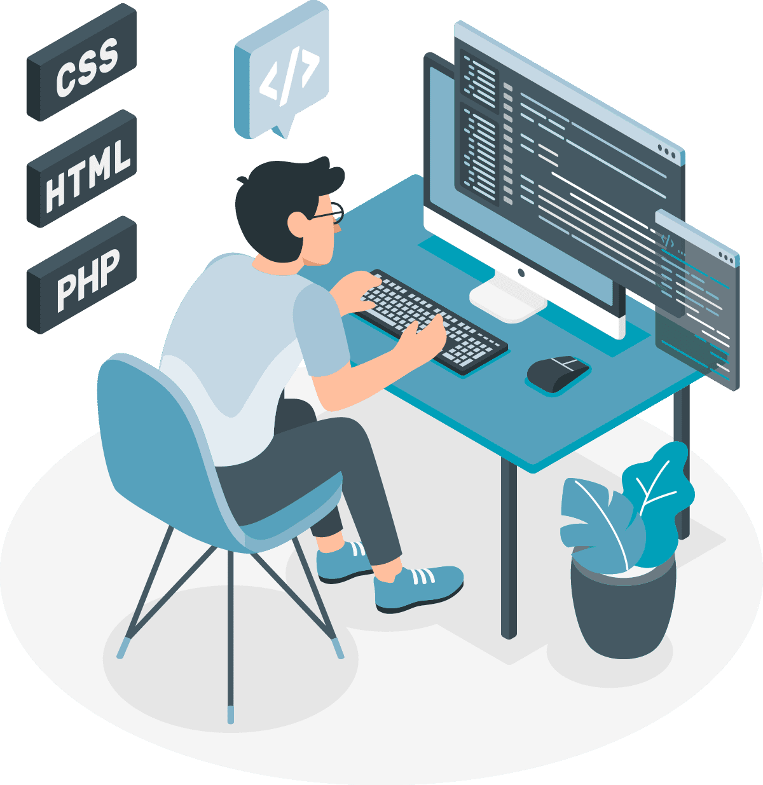

# Flavio Rafael Cardozo 👨‍💻
## Nova Odessa-SP 
## flavero@gmail.com    - (19) 99882-1845

## [Linkedin](https://br.linkedin.com/in/flavio-rafael-cardozo-66a763143)
## [GitHub](https://github.com/flavero85)

> "Em algum, algo incrível está esperando para ser descoberto." Carls Sagan
### Objetivo: Dev Front-End
- Técnico em Informática, Senac Americana [2023 - 2025]
- Tecnico em Manutenção e Suporte  informática [2022 - 2023]

## Cursos Livres
- Excel, Senac Americana [24h]
- Arduíno, Senac Americana [40h]
- Web Designer, Danki Code [90h]
- Lógica de Programação, Unicamp EAD [20h]
- Cursando Front-End e Back-End, Danki Code [1200h]

## Experiência Profissional
- Autonômo Manutenção e Suporte a Informática 
